# Noushin Nabavi, PhD

### Cell & Systems Biologist · Data Scientist

*Turning complex biological and social questions into reproducible analysis, useful models, and evidence-informed decisions.*

---

## About me

I am a cell and systems biologist and data scientist interested in how evidence, computation, and systems thinking can help us understand complex problems.

My work spans molecular and cellular biology, cancer multi-omics, reproducible data analysis, economic and policy research, and educational modelling. I enjoy translating scientific ideas into transparent analytical tools that support learning and evidence-informed decision-making.

- 🔬 PhD in Cell & Systems Biology from the University of Toronto
- 🧬 Research experience in stem cells, aging, pharmacology, and cancer genomics
- 📊 Experience applying data science to public policy and economic analysis
- 🧩 Current interests include complexity, emergence, artificial life, and scientific education
- 📍 Based in Victoria, British Columbia, Canada

## Current focus

- Developing educational R tools for exploring **emergence and complex systems**
- Building simplified models of **artificial life, self-organization, and agent interaction**
- Creating accessible resources for **experimentation and evidence-based decision-making**
- Exploring reproducible approaches to biological, social, and policy questions

## Featured work

### [emergenceModelR](https://github.com/NoushinN/emergenceModelR)

An educational R package for exploring emergence, self-organization, cellular automata, agent interactions, and network growth.

[Documentation](https://noushinn.github.io/emergenceModelR/) · [Getting started](https://noushinn.github.io/emergenceModelR/articles/getting-started.html)

### [artificialLifeR](https://github.com/NoushinN/artificialLifeR)

An educational toolkit for examining simplified artificial-life concepts, including agents, resources, metabolism-like constraints, reproduction, and population dynamics.

[Documentation](https://noushinn.github.io/artificialLifeR/) · [Resource competition tutorial](https://noushinn.github.io/artificialLifeR/articles/resource-competition-tutorial.html)

### [Initiating an Experiment](https://noushinn.github.io/experimentation_course/)

An open learning resource developed for the Government of Canada's Experimentation Works program, covering problem definition, research questions, stakeholder engagement, and experimental design in the public service.

### Earlier collaborative projects

- [Anatomy of Morbidity](https://github.com/NoushinN/Anatomy-of-Morbidity) — UBC hackathon project exploring health and morbidity data
- [COVID-19 Analysis](https://github.com/NoushinN/covid_19_analysis) — reproducible analysis of Johns Hopkins COVID-19 data
- [Code vs COVID-19](https://github.com/NoushinN/codevscovid19) — simulation of hospital supply and demand
- [BC Economic Status Indices](https://github.com/bcgov/bc-econ-status-indices) — area-based economic indices for British Columbia

## Toolkit

The visualization presents broad areas of experience and current focus; it is not intended as a numerical proficiency score.

  
  
  
  
  
  
  
  
  
  

## Research journey

My scientific work began in cell and molecular biology and developed through research on bone differentiation, microgravity-related bone loss, aging, drug metabolism, and rare-cancer multi-omics. I later brought that scientific perspective into public-sector data science, economics, policy analysis, and experimentation.

Across these areas, one principle remains constant: **methods should be transparent, evidence should be interpreted carefully, and analytical work should be useful to others.**

## Beyond the code

I am also interested in science communication, open knowledge, human rights, and the relationship between complex systems, life, and consciousness. Away from the screen, I enjoy travelling, hiking, dancing, writing, painting, and photography.

---

### Explore more

Visit my [portfolio](https://noushinn.github.io/) for my biography, publications, professional activities, and other work.

